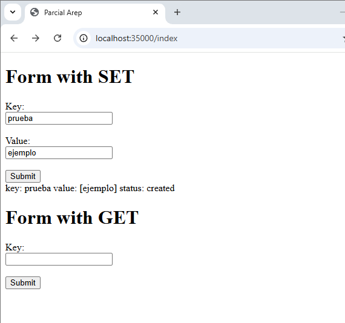

# Parcial01-AREP

### Como ejecutarlo
Para correr el proyecto se debe primero realizar el comando "mvn clean package"

Despues de eso en dos terminales distintas se usaran los siguientes comandos:

-Para correr el FacadeServer

-Para correr el HttpServer(Back)

### Pruebas

Se evidencia como se hace uso del metodo setkv

-Primero veremos el index/front que se hizo

-Despues meti estos datos como prueba y se ve que se ejecuto correctamente.

-Ahora haremos el Get con la siguiente prueba en base de la llave ingresada en el ejemplo anterior.

-Y por ultimo vemos como regresa el valor esperado en base al set que se realizo previamente

